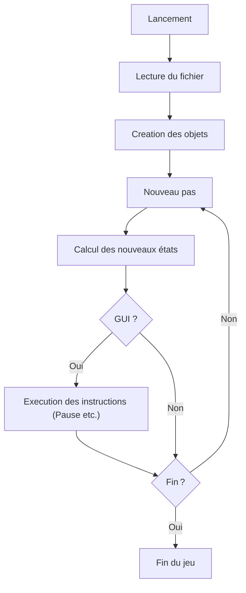

```mermaid

flowchart TD
    A[Lancement] --> B[Lecture du fichier]
    B --> C[Creation des objets]
    C --> D[Nouveau pas]
    D --> E[Calcul des nouveaux états]
    E --> F{GUI ?}
    F -- Oui --> I["Execution des instructions (Pause etc.)"]
    I --> G{Fin ?}
    F -- Non --> G
    G -- Oui --> H[Fin du jeu]
    G -- Non --> D

``` 