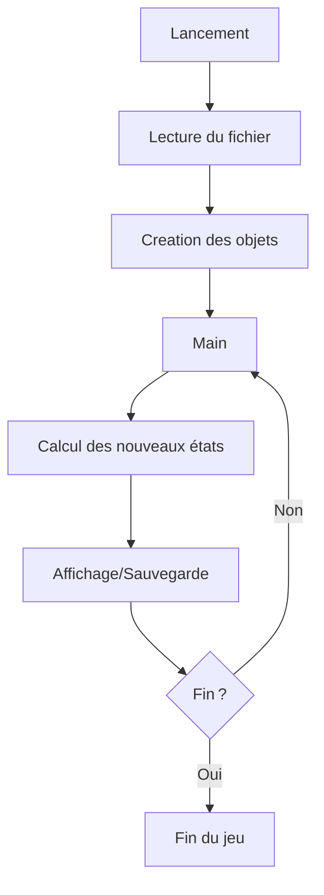

```mermaid

flowchart TD
    A[Lancement] --> B[Lecture du fichier]
    B --> C["Creation des objets"]
    C --> D[Main]
    D --> E[Calcul des nouveaux états]
    E --> F[Affichage/Sauvegarde]
    F --> G{Fin ?}
    G -- Oui --> H[Fin du jeu]
    G -- Non --> D

```