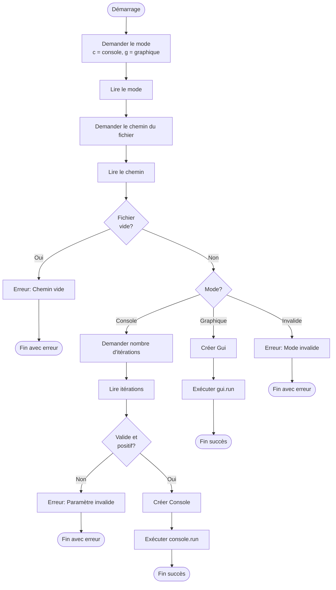

```mermaid
flowchart TD
    Start([Démarrage]) --> InputMode[Demander le mode<br/>c = console, g = graphique]
    InputMode --> ReadMode[Lire le mode]
    ReadMode --> InputFile[Demander le chemin du fichier]
    InputFile --> ReadFile[Lire le chemin]
    ReadFile --> CheckEmpty{Fichier<br/>vide?}
    
    CheckEmpty -->|Oui| ErrorEmpty[Erreur: Chemin vide]
    ErrorEmpty --> End1([Fin avec erreur])
    
    CheckEmpty -->|Non| CheckMode{Mode?}
    
    CheckMode -->|Console| InputIter[Demander nombre d'itérations]
    InputIter --> ReadIter[Lire itérations]
    ReadIter --> ValidateIter{Valide et<br/>positif?}
    ValidateIter -->|Non| ErrorIter[Erreur: Paramètre invalide]
    ErrorIter --> End2([Fin avec erreur])
    ValidateIter -->|Oui| CreateConsole[Créer Console]
    CreateConsole --> RunConsole[Exécuter console.run]
    RunConsole --> End3([Fin succès])
    
    CheckMode -->|Graphique| CreateGui[Créer Gui]
    CreateGui --> RunGui[Exécuter gui.run]
    RunGui --> End4([Fin succès])
    
    CheckMode -->|Invalide| ErrorMode[Erreur: Mode invalide]
    ErrorMode --> End5([Fin avec erreur])
``` 