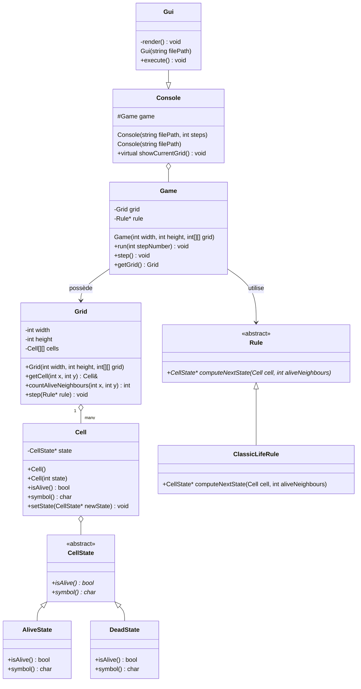

```mermaid
classDiagram
    %% --- Logique métier ---

    class Game {
        -Grid grid
        -Rule* rule

        Game(int width, int height, int[][] grid)

        +run(int stepNumber) void
        +step() void
        +getGrid() Grid
    }

    class Grid {
        -int width
        -int height
        -Cell[][] cells

        +Grid(int width, int height, int[][] grid)

        +getCell(int x, int y) Cell&
        +countAliveNeighbours(int x, int y) int
        +step(Rule* rule) void
    }

    class Cell {
        -CellState* state

        +Cell()
        +Cell(int state)

        +isAlive() bool
        +symbol() char
        +setState(CellState* newState) void
    }

    class CellState {
        <<abstract>>
        +isAlive() bool*
        +symbol() char*
    }

    class AliveState {
        +isAlive() bool
        +symbol() char
    }

    class DeadState {
        +isAlive() bool
        +symbol() char
    }

    class Rule {
        <<abstract>>
        +CellState* computeNextState(Cell cell, int aliveNeighbours)*
    }

    class ClassicLifeRule {
        +CellState* computeNextState(Cell cell, int aliveNeighbours)
    }

    class Console {
        #Game game

        Console(string filePath, int steps)
        Console(string filePath)

        +virtual showCurrentGrid() void

    }

    class Gui {
        -render() void
        Gui(string filePath)
        +execute() void
    }

    %% --- Relations ---

    Game --> Grid : possède
    Game --> Rule : utilise

    Grid "1" o-- "many" Cell
    Cell o-- CellState

    CellState <|-- AliveState
    CellState <|-- DeadState

    Rule <|-- ClassicLifeRule
    Console o-- Game
    Gui --|> Console

```