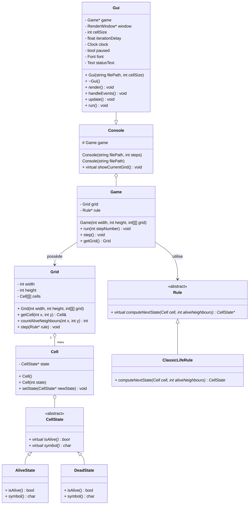

```mermaid
classDiagram
    %% --- Logique métier ---

    class Game {
        - Grid grid
        - Rule* rule

        Game(int width, int height, int[][] grid)

        + run(int stepNumber) void
        + step() void
        + getGrid() Grid
    }

    class Grid {
        - int width
        - int height
        - Cell[][] cells

        + Grid(int width, int height, int[][] grid)

        + getCell(int x, int y) Cell&
        + countAliveNeighbours(int x, int y) int
        + step(Rule* rule) void
    }

    class Cell {
        - CellState* state

        + Cell()
        + Cell(int state)

        + setState(CellState* newState) void
    }

    class CellState {
        <<abstract>>
        + virtual isAlive() bool*
        + virtual symbol() char*
    }

    class AliveState {
        + isAlive() bool
        + symbol() char
    }

    class DeadState {
        + isAlive() bool
        + symbol() char
    }

    class Rule {
        <<abstract>>
        + virtual computeNextState(Cell cell, int aliveNeighbours)* CellState*
    }

    class ClassicLifeRule {
        + computeNextState(Cell cell, int aliveNeighbours) CellState*
    }

    class Console {
        # Game game

        Console(string filePath, int steps)
        Console(string filePath)

        + virtual showCurrentGrid() void

    }

    class Gui {
        - Game* game
        - RenderWindow* window
        - int cellSize
        - float iterationDelay
        - Clock clock
        - bool paused
        - Font font    
        - Text statusText
        + Gui(string filePath, int cellSize)
        + ~Gui()
        + render() void
        + handleEvents() void
        + update() void
        + run() void
    }

    %% --- Relations ---

    Game --> Grid : possède
    Game --> Rule : utilise

    Grid "1" o-- "many" Cell
    Cell o-- CellState

    CellState <|-- AliveState
    CellState <|-- DeadState

    Rule <|-- ClassicLifeRule
    Console o-- Game
    Gui --|> Console

```