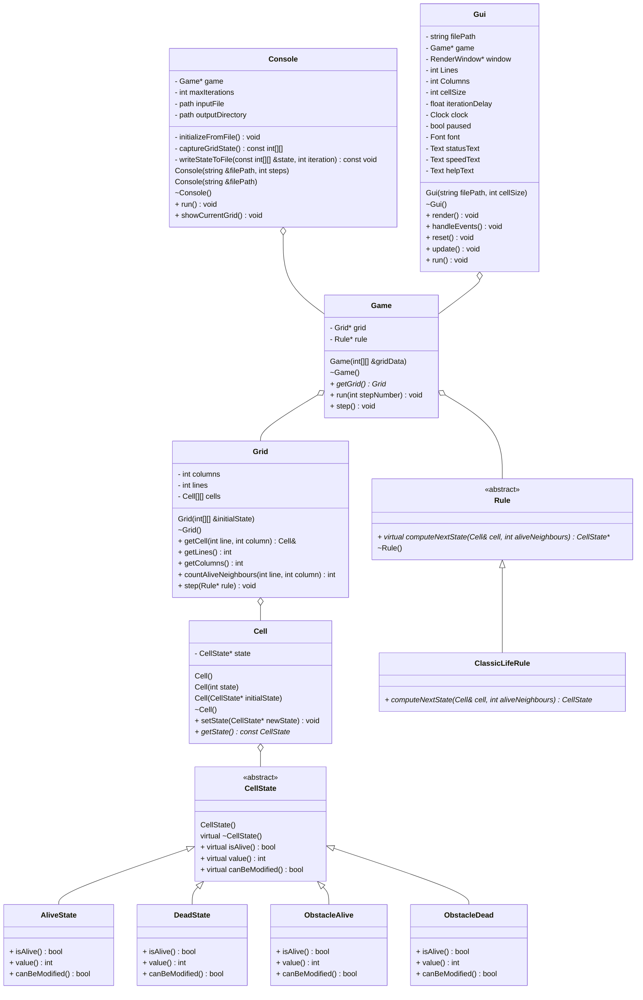

```mermaid
classDiagram
    %% --- Logique métier ---

    class Game {
        - Grid* grid
        - Rule* rule

        Game(int[][] &gridData)
        ~Game()
        + getGrid() Grid*
        + run(int stepNumber) void
        + step() void
    }

    class Grid {
        - int columns
        - int lines
        - Cell[][] cells

        Grid(int[][] &initialState)
        ~Grid()
        + getCell(int line, int column) Cell&
        + getLines() int
        + getColumns() int
        + countAliveNeighbours(int line, int column) int
        + step(Rule* rule) void
    }

    class Cell {
        - CellState* state

        Cell()
        Cell(int state)
        Cell(CellState* initialState)
        ~Cell()

        + setState(CellState* newState) void
        + getState() const CellState*
    }

    class CellState {
        <<abstract>>
        CellState()
        virtual ~CellState()
        + virtual isAlive() bool
        + virtual value() int
        + virtual canBeModified() bool
    }

    class AliveState {
        + isAlive() bool
        + value() int
        + canBeModified() bool
    }

    class DeadState {
        + isAlive() bool
        + value() int
        + canBeModified() bool
    }

    class ObstacleAlive{
        + isAlive() bool
        + value() int
        + canBeModified() bool
    }

    class ObstacleDead{
        + isAlive() bool
        + value() int
        + canBeModified() bool
    }

    class Rule {
        <<abstract>>
        + virtual computeNextState(Cell& cell, int aliveNeighbours)* CellState*
        ~Rule()
    }

    class ClassicLifeRule {
        + computeNextState(Cell& cell, int aliveNeighbours) CellState*
    }

    class Console {
        - Game* game
        - int maxIterations
        - path inputFile 
        - path outputDirectory
        - initializeFromFile() void
        - captureGridState() const int[][]       
        - writeStateToFile(const int[][] &state, int iteration) const void

        Console(string &filePath, int steps)
        Console(string &filePath)
        ~Console()

        + run() void
        + showCurrentGrid() void

    }

    class Gui {
        - string filePath
        - Game* game
        - RenderWindow* window
        - int Lines
        - int Columns
        - int cellSize
        - float iterationDelay
        - Clock clock
        - bool paused
        - Font font    
        - Text statusText
        - Text speedText
        - Text helpText

        Gui(string filePath, int cellSize)
        ~Gui()

        + render() void
        + handleEvents() void
        + reset() void
        + update() void
        + run() void
    }

    %% --- Relations ---

    Game o-- Grid 
    Game o-- Rule 

    Grid  o-- Cell
    Cell o-- CellState

    CellState <|-- AliveState
    CellState <|-- DeadState
    CellState <|-- ObstacleAlive
    CellState <|-- ObstacleDead

    Rule <|-- ClassicLifeRule
    Console o-- Game
    Gui o-- Game

```